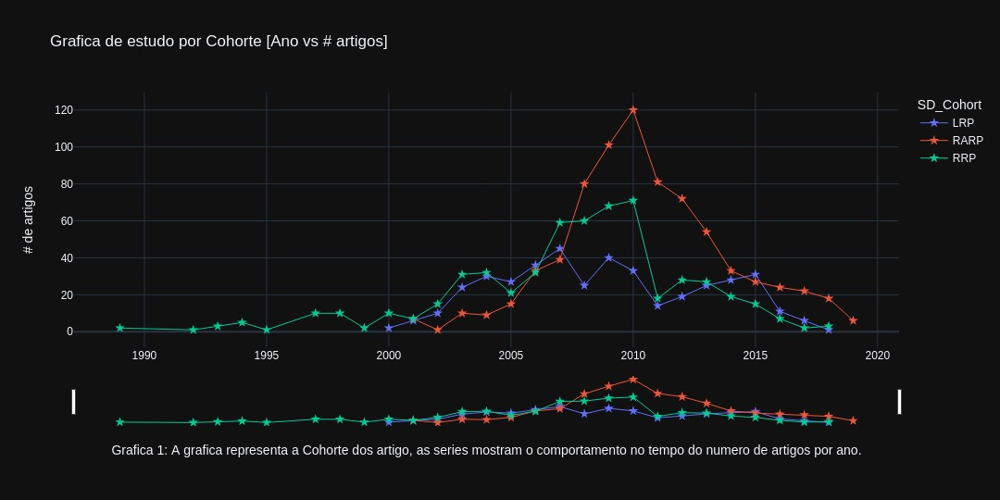
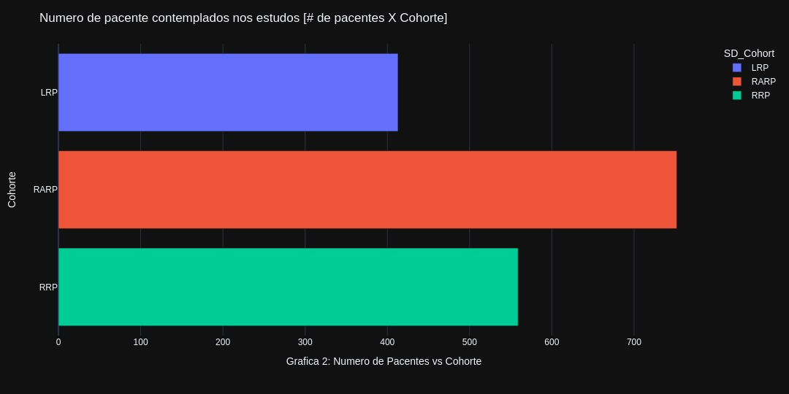
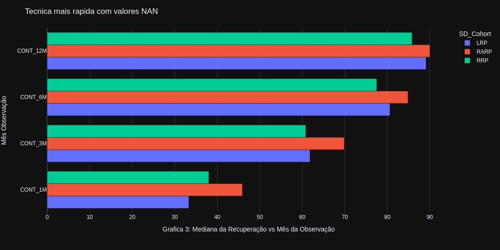
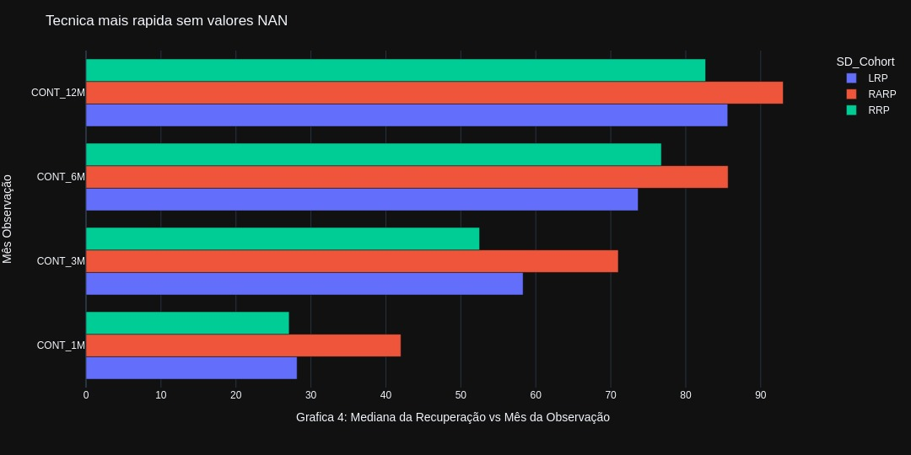

# <center> **Atividade Prática 2**
<center>Alunos:

## **Wladimir Arturo Garcés Carrillo [RA204059]**

## **Suelen Aparecida Ribeiro de Souza [RA252483]** </center>
#
### **Nota inicial:**

Pode ver os graficos interativos no arquivo ```entrega1.ipynb``` ou nos arquivos com o nome do grafico e extenção ```Grafico<1/2/3/4>.html```.
#
### 1. **Quantos estudos contemplam cada uma das três técnicas de cirurgia (RRP, LRP, RARP) por ano?**

<center>



</center>

>Segundo a grafica 1 faremos uma descripção detalhada do comportamento dos estudos desde o inicio do uso de tecnicas de Prostatectomia, a seguir:
>
>- Estudos sobre a técnica RRP começaram a ser publicados em 1989, variando entre 1, 2 e 3 até 1993.
>- Em 1994 tiveram 5 trabalhos publicados, mas até então, esse assunto não despertava muito interesse na época.
>- Em 1997 e 1998 tiveram 10 trabalhos publicados sobre essa técnica cirúrgica.
>- Em 1999 houve uma queda para 2 trabalhos publicados.
>- No ano de 2000, surgiu também a técnica LRP e os trabalhos sobre RRP voltaram para a marca de 10 artigos publicados naquele ano, enquanto a técnica nova rendeu 2 artigos.
>- No ano de 2001, surgiu mais uma técnica, a RARP, e foram publicados 7 trabalhos sobre cada uma das três técnicas, LRP, RARP E RRP.
>- Em 2002, foi publicado apenas um artigo sobre a RARP, 10 sobre LRP e 15 sobre RRP.
>- Em 2003, foram publicados 10 artigos sobre RARP, 24 sobre LRP e 31 sobre RRP.
>- Em 2004, foram publicados 9 artigos sobre RARP, 30 sobre LRP e 32 sobre RRP.
>- Em 2005, foram publicados 15 trabalhos sobre RARP, 21 sobre RRP e 27 sobre LRP.
>- Em 2006, foram publicados 32 artigos sobre RRP, 33 sobre RARP e 36 sobre LRP.
>- Em 2007, foram publicados 39 trabalhos sobre RARP, 45 sobre LRP e 59 sobre RRP.
>- Em 2008, houve um boom de publicações sobre RARP, com 80 trabalhos publicados naquele ano, contra 60 de RRP e 25 sobre LRP. Esse boom poderia ser justificado também pela entrada de países desenvolvidos e grandes centros de pesquisa que investiram na técnica de RARP.
>- Em 2009, houve 101 publicações sobre RARP, 68 sobre RRP e 40 sobre LRP.
>- Em 2010, foi o auge de publicações sobre RARP, com o total de 120, enquanto que a técnica de RRP atingiu 71 publicações e LRP, 33 publicações.
>- Em 2011, as publicações relacionadas com a três técnicas começaram a declinar, com 81 publicações sobre RARP, 18 sobre RRP e 14 sobre LRP.
>- Em 2012, houveram 72 publicações sobre RARP, 28 sobre RRP e 19 sobre LRP.
>- Em 2013, foram publicados 54 estudos sobre RARP, 27 sobre RRP e 25 sobre LRP.
>- Em 2014, foram publicados 33 trabalhos sobre RARP, 28 sobre LRP e 19 sobre RRP.
>- Em 2015, foram registrados 31 artigos sobre LRP, 27 sobre RARP e 15 sobre RRP.
>- Em 2016, 24 artigos foram publicados sobre RARP, 11 sobre LRP e 7 sobre RRP.
>- Em 2017, foram publicados 22 trabalhos sobre RARP, 6 sobre LRP e 2 sobre RRP.
>- Em 2018, foram publicados 18 artigos sobre RARP, 3 sobre RRP  e 1 sobre LRP.
>- Em 2019, apenas um trabalho foi publicado sobre RARP e não houve publicações sobre as demais técnicas.


### 2. **Qual das técnicas cirúrgicas teve um maior número de pacientes contemplados nos estudos?**

<center>



</center>

>Segundo as informações disponíveis na tabela do excel e como se mostra na Grafica 2, a técnica que mais contemplou pacientes foi a cirurgia robótica *Robot-Assisted Radical Prostatectomy* (**RARP**), com 752 pacientes ao longo de tudos os estudos.

### 3. **Baseados nos dados desta revisão sistemática reversa, qual das técnicas proporciona uma recuperação mais rápida da continência urinária?**

> Para responder a essa pergunta, queríamos experimentar duas maneiras e ver se havia diferenças nas conclusões. Para ambos os casos, extraímos os dados de relevância relacionados à questão, ou seja, extraímos do conjunto de dados original a coluna Coortes e os dados de incontinência relacionados aos meses de observação. Também verificamos o tipo de dados que estávamos manipulando e encontramos apenas dois erros de consistência de tipo de dados que conseguimos corrigir rapidamente.
> No primeiro caso, extraímos a mediana do percentual de recuperação para cada intervalo de tempo observado e agrupamos esses valores por coorte, sem retirar os valores nulos. O Gráfico 3 mostra os resultados obtidos para este caso.

<center>



</center>

> No segundo caso removemos os valores nulos, removendo um grande número de amostras, passando de cerca de 1700 amostras para apenas 130. No Gráfico 4 podemos ver os resultados deste processo.

<center>



</center>

> Em conclusão, observamos que os resultados para ambos os casos é que a recuperação mais rápida é com a técnica RARP, pois, apenas no primeiro mês, acumula um maior número de pacientes recuperados, ao contrário das outras duas técnicas; Isso continua durante todas as observações, a evidência disso pode ser vista nos gráficos 3 e 4. Também pudemos observar que em nosso tratamento dos dados, aparentemente, não retiramos valores significativos para nossa interpretação final, teria que estudar se esse processo de tratamento é totalmente adequado ou foi apenas uma coincidência.
